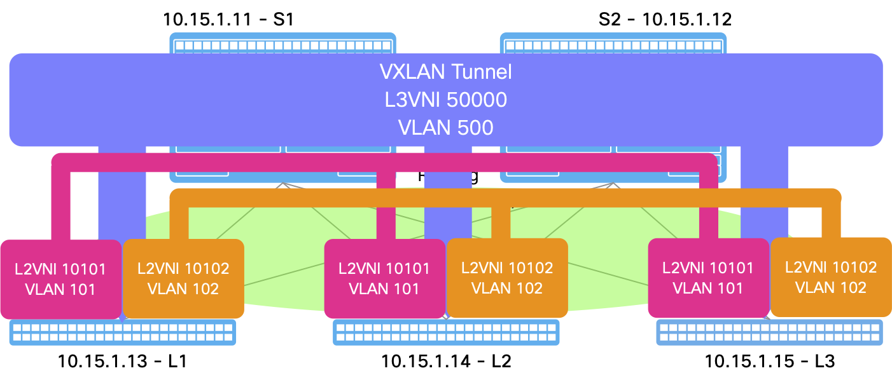

# BRKDCN-2946: Infra-as-Code for NXOS & NDFC with Ansible

This repo contains the reference playbook with the VXLAN EVPN IaC at Cisco Live for Cisco NX-OS.




## Cloning Repo

```bash
git clone https://github.com/mtarking/BRKDCN-2946.git
```

## Execute setup.sh
```bash
./setup.sh
```

Note: You will need to replace the devices in inventory files and host_vars with your devices' information.

## Executing Ansible Playbook

```bash
ansible-playbook -i nxos/inventory.yml nxos/vxlan.yml
```
